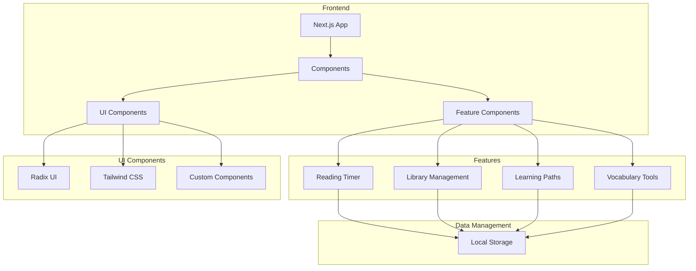

# 📚 EchoRead Dashboard

<div align="center">
  <!--  -->
  
  [](https://nextjs.org/)
  [](https://www.typescriptlang.org/)
  [](https://tailwindcss.com/)
  [](LICENSE)
  [](https://github.com/Suhani2305/EchoRead)
</div>

## 📋 Overview

EchoRead is a comprehensive reading dashboard designed to enhance the reading experience and track reading progress. This modern web application helps readers manage their reading journey, track progress, and gain insights into their reading habits.

<div align="center">
  <h3>📱 Dashboard Screenshots</h3>
  
  
  
  
  
</div>

## 🎯 Project Objectives

1. **Reading Progress Tracking**
   - Monitor reading time and speed
   - Track completed books and pages
   - Set and achieve reading goals
   - Visualize reading patterns

2. **Learning Path Management**
   - Create personalized learning paths
   - Track progress through courses
   - Set milestones and achievements
   - Monitor completion rates

3. **Vocabulary Enhancement**
   - Track new words learned
   - Create custom word lists
   - Practice vocabulary through quizzes
   - Monitor vocabulary growth

4. **Reading Analytics**
   - Analyze reading habits
   - Track reading streaks
   - Monitor comprehension levels
   - Generate reading insights

5. **Book Management**
   - Organize reading library
   - Create bookmarks and notes
   - Track reading history
   - Manage reading lists

## 🌟 Key Features

<table>
  <tr>
    <td width="25%">
      <div align="center">
        <h3>📊 Reading Stats</h3>
        <ul align="left">
          <li>Reading time tracking</li>
          <li>Progress visualization</li>
          <li>Reading speed analysis</li>
          <li>Completion rates</li>
        </ul>
      </div>
    </td>
    <td width="25%">
      <div align="center">
        <h3>📚 Library Management</h3>
        <ul align="left">
          <li>Book organization</li>
          <li>Reading lists</li>
          <li>Bookmarks</li>
          <li>Notes management</li>
        </ul>
      </div>
    </td>
    <td width="25%">
      <div align="center">
        <h3>🎯 Learning Paths</h3>
        <ul align="left">
          <li>Custom learning paths</li>
          <li>Progress tracking</li>
          <li>Milestone setting</li>
          <li>Achievement system</li>
        </ul>
      </div>
    </td>
    <td width="25%">
      <div align="center">
        <h3>📝 Vocabulary Tools</h3>
        <ul align="left">
          <li>Word tracking</li>
          <li>Custom lists</li>
          <li>Quiz system</li>
          <li>Progress monitoring</li>
        </ul>
      </div>
    </td>
  </tr>
</table>

## 🛠️ Technical Stack

<div align="center">
  
  
  
  
  
  
</div>

## 📊 System Architecture



## 🚀 Getting Started

### Prerequisites
- Node.js 18 or higher
- PNPM package manager
- Git

### Installation

1. Clone the repository
```bash
git clone https://github.com/Suhani2305/EchoRead.git
cd EchoRead
```

2. Install dependencies
```bash
pnpm install
```

3. Start the development server
```bash
pnpm dev
```

4. Access the dashboard at `http://localhost:3000`

## 📁 Project Structure

```
EchoRead/
├── app/                    # Next.js app directory
│   ├── page.tsx           # Home page
│   ├── layout.tsx         # Root layout
│   └── [...routes]        # Other routes
├── components/            # React components
│   ├── ui/               # UI components
│   └── features/         # Feature components
├── lib/                  # Utility functions
├── styles/              # Global styles
├── public/             # Static assets
└── README.md          # Project documentation
```

## 🔧 Technical Details

### Frontend Architecture
- Next.js 15 with App Router
- TypeScript for type safety
- Tailwind CSS for styling
- Radix UI for components
- Recharts for data visualization

### Features Implementation
1. **Reading Timer**
   - Real-time tracking
   - Session management
   - Progress visualization

2. **Library Management**
   - Book organization
   - Reading lists
   - Bookmarks system

3. **Learning Paths**
   - Progress tracking
   - Milestone system
   - Achievement tracking

4. **Vocabulary Tools**
   - Word tracking
   - Quiz system
   - Progress monitoring

## 📈 Performance Optimization

- Component lazy loading
- Image optimization
- Route prefetching
- State management
- Caching strategies

## 🔐 Security Features

- Input validation
- XSS protection
- CSRF protection
- Secure headers
- Error handling

## 📈 Future Roadmap

- [ ] User authentication
- [ ] Cloud sync
- [ ] Mobile app version
- [ ] Social features
- [ ] Advanced analytics
- [ ] AI-powered recommendations
- [ ] Custom themes
- [ ] Export options

## 🤝 Contributing

Contributions are welcome! Please feel free to submit a Pull Request.

1. Fork the repository
2. Create your feature branch (`git checkout -b feature/AmazingFeature`)
3. Commit your changes (`git commit -m 'Add some AmazingFeature'`)
4. Push to the branch (`git push origin feature/AmazingFeature`)
5. Open a Pull Request

## 📄 License

This project is licensed under the MIT License - see the [LICENSE](LICENSE) file for details.

## 📞 Contact

For any queries or support, please contact:
- Email: suhani2305@gmail.com
- GitHub: [@Suhani2305](https://github.com/Suhani2305)
- LinkedIn: [Suhani](https://linkedin.com/in/suhani2305)

---

<div align="center">
  <p>Made with ❤️ by Suhani Rawat</p>
  <p>© 2024 EchoRead Dashboard</p>
</div> 